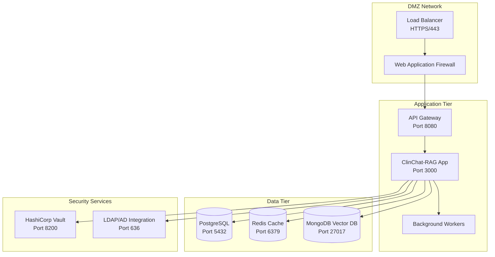

# 🚀 ClinChat-RAG Deployment Guide

## 📋 Table of Contents

- [Overview](#overview)
- [Prerequisites](#prerequisites)
- [Medical Environment Requirements](#medical-environment-requirements)
- [Infrastructure Setup](#infrastructure-setup)
- [Container Deployment](#container-deployment)
- [Kubernetes Deployment](#kubernetes-deployment)
- [Security Configuration](#security-configuration)
- [Monitoring Setup](#monitoring-setup)
- [Backup and Recovery](#backup-and-recovery)
- [Compliance Validation](#compliance-validation)
- [Troubleshooting](#troubleshooting)

## 🎯 Overview

This guide provides step-by-step instructions for deploying ClinChat-RAG in production healthcare environments. All deployment configurations are designed to meet HIPAA compliance requirements and medical industry standards.

**Supported Environments:**
- 🏥 Hospital Data Centers
- ☁️ HIPAA-Compliant Cloud (AWS, Azure, GCP)
- 🔒 Private Healthcare Clouds
- 🏢 Medical Practice Networks

## 📋 Prerequisites

### System Requirements

#### Minimum Hardware Specifications
```yaml
Production Environment:
  CPU: "16 cores (Intel Xeon or AMD EPYC)"
  RAM: "64 GB"
  Storage: "1 TB SSD (NVMe preferred)"
  Network: "10 Gbps connection"
  
Staging Environment:
  CPU: "8 cores"
  RAM: "32 GB"
  Storage: "500 GB SSD"
  Network: "1 Gbps connection"

Development Environment:
  CPU: "4 cores"
  RAM: "16 GB"
  Storage: "256 GB SSD"
  Network: "100 Mbps connection"
```

#### Software Dependencies
```bash
# Required Software Stack
Docker: ">=24.0.0"
Kubernetes: ">=1.28.0"
Helm: ">=3.12.0"
kubectl: ">=1.28.0"

# Database Requirements
PostgreSQL: ">=14.0"
Redis: ">=7.0"
MongoDB: ">=6.0" # For vector storage

# Security Tools
cert-manager: ">=1.12.0"
Istio: ">=1.19.0" # Service mesh for mTLS
HashiCorp Vault: ">=1.14.0" # Secrets management
```

### Network Architecture


## 🏥 Medical Environment Requirements

### HIPAA Compliance Checklist
```markdown
## Pre-Deployment Compliance Verification

- [ ] **Business Associate Agreement (BAA) Signed**
  - Cloud provider BAA executed
  - Third-party service provider agreements
  - Vendor risk assessments completed

- [ ] **Security Controls Implemented**
  - Multi-factor authentication configured
  - Role-based access controls defined
  - Audit logging enabled
  - Data encryption at rest and in transit

- [ ] **Network Security**
  - VPN or private network connectivity
  - Network segmentation implemented
  - Firewall rules configured
  - Intrusion detection system active

- [ ] **Data Protection**
  - PHI handling procedures documented
  - De-identification processes tested
  - Backup encryption verified
  - Data retention policies configured

- [ ] **Incident Response**
  - Security incident response plan
  - Breach notification procedures
  - Contact information updated
  - Response team trained
```

### Medical Device Integration (FDA Guidelines)
```yaml
Medical Device Classification:
  Class: "II - Medical Device Software"
  FDA_510k: "Required for clinical decision support"
  Quality_Management: "ISO 13485 compliant"
  
Clinical Validation:
  Evidence_Level: "Real-world clinical studies"
  Efficacy_Testing: "Comparative effectiveness research"
  Safety_Monitoring: "Continuous post-market surveillance"
  
Regulatory Compliance:
  FDA_QSR: "Quality System Regulation compliance"
  Clinical_Evaluation: "IEC 62304 software lifecycle"
  Risk_Management: "ISO 14971 risk analysis"
```

## 🛠️ Infrastructure Setup

### Cloud Provider Setup (AWS Example)

#### 1. VPC Configuration
```bash
# Create HIPAA-compliant VPC
aws ec2 create-vpc \
  --cidr-block 10.0.0.0/16 \
  --tag-specifications 'ResourceType=vpc,Tags=[{Key=Name,Value=clinchat-prod-vpc},{Key=Environment,Value=production},{Key=Compliance,Value=HIPAA}]'

# Create private subnets for database tier
aws ec2 create-subnet \
  --vpc-id vpc-xxxxxxxxx \
  --cidr-block 10.0.1.0/24 \
  --availability-zone us-east-1a \
  --tag-specifications 'ResourceType=subnet,Tags=[{Key=Name,Value=clinchat-db-subnet-1a},{Key=Tier,Value=database}]'

# Create application subnets
aws ec2 create-subnet \
  --vpc-id vpc-xxxxxxxxx \
  --cidr-block 10.0.2.0/24 \
  --availability-zone us-east-1a \
  --tag-specifications 'ResourceType=subnet,Tags=[{Key=Name,Value=clinchat-app-subnet-1a},{Key=Tier,Value=application}]'
```

#### 2. Security Groups
```bash
# Database security group
aws ec2 create-security-group \
  --group-name clinchat-db-sg \
  --description "ClinChat Database Security Group" \
  --vpc-id vpc-xxxxxxxxx

# Allow PostgreSQL from application tier only
aws ec2 authorize-security-group-ingress \
  --group-id sg-xxxxxxxxx \
  --protocol tcp \
  --port 5432 \
  --source-group sg-yyyyyyyyy

# Application security group
aws ec2 create-security-group \
  --group-name clinchat-app-sg \
  --description "ClinChat Application Security Group" \
  --vpc-id vpc-xxxxxxxxx

# Allow HTTPS from load balancer
aws ec2 authorize-security-group-ingress \
  --group-id sg-yyyyyyyyy \
  --protocol tcp \
  --port 443 \
  --source-group sg-zzzzzzzzz
```

#### 3. RDS Database Setup
```yaml
# rds-config.yaml
Parameters:
  DBInstanceClass: db.r6g.2xlarge
  DBEngine: postgres
  DBEngineVersion: "14.9"
  AllocatedStorage: 1000
  StorageType: io2
  Iops: 10000
  StorageEncrypted: true
  KmsKeyId: "arn:aws:kms:us-east-1:account:key/key-id"
  
  # HIPAA Compliance Settings
  BackupRetentionPeriod: 35
  DeletionProtection: true
  MultiAZ: true
  
  # Security Settings
  VpcSecurityGroupIds:
    - sg-xxxxxxxxx
  DBSubnetGroupName: clinchat-db-subnet-group
  
  # Monitoring
  MonitoringInterval: 60
  MonitoringRoleArn: "arn:aws:iam::account:role/rds-monitoring-role"
  PerformanceInsightsEnabled: true
  PerformanceInsightsKMSKeyId: "arn:aws:kms:us-east-1:account:key/key-id"
```

### Kubernetes Cluster Setup

#### 1. EKS Cluster Configuration
```yaml
# cluster-config.yaml
apiVersion: eksctl.io/v1alpha5
kind: ClusterConfig

metadata:
  name: clinchat-prod
  region: us-east-1
  version: "1.28"
  tags:
    Environment: production
    Compliance: HIPAA
    Application: clinchat-rag

vpc:
  id: vpc-xxxxxxxxx
  subnets:
    private:
      us-east-1a: { id: subnet-xxxxxxxxx }
      us-east-1b: { id: subnet-yyyyyyyyy }

nodeGroups:
  - name: clinchat-workers
    instanceType: m6i.2xlarge
    desiredCapacity: 3
    minSize: 2
    maxSize: 10
    volumeSize: 100
    volumeType: gp3
    volumeEncrypted: true
    
    # HIPAA compliance
    privateNetworking: true
    
    # Security
    iam:
      attachPolicyARNs:
        - arn:aws:iam::aws:policy/AmazonEKSWorkerNodePolicy
        - arn:aws:iam::aws:policy/AmazonEKS_CNI_Policy
        - arn:aws:iam::aws:policy/AmazonEC2ContainerRegistryReadOnly
    
    # Tagging
    tags:
      NodeType: application
      Compliance: HIPAA

addons:
  - name: vpc-cni
  - name: coredns
  - name: kube-proxy
  - name: aws-ebs-csi-driver

cloudWatch:
  clusterLogging:
    enableTypes: ["*"]
```

#### 2. Deploy Cluster
```bash
# Create EKS cluster
eksctl create cluster -f cluster-config.yaml

# Verify cluster
kubectl get nodes
kubectl get pods -A

# Install essential add-ons
kubectl apply -f https://raw.githubusercontent.com/kubernetes/ingress-nginx/controller-v1.8.2/deploy/static/provider/aws/deploy.yaml
```

## 🐳 Container Deployment

### Docker Configuration

#### 1. Multi-stage Dockerfile Optimization
```dockerfile
# Production Dockerfile
FROM node:18-alpine AS base
WORKDIR /app

# Security: Create non-root user
RUN addgroup -g 1001 -S nodejs
RUN adduser -S clinchat -u 1001

# Dependencies stage
FROM base AS deps
COPY package*.json ./
RUN npm ci --only=production && npm cache clean --force

# Build stage
FROM base AS build
COPY package*.json ./
RUN npm ci
COPY . .
RUN npm run build

# Production stage
FROM base AS runtime

# Security hardening
RUN apk update && apk upgrade
RUN apk add --no-cache dumb-init

# Copy built application
COPY --from=deps /app/node_modules ./node_modules
COPY --from=build /app/.next ./.next
COPY --from=build /app/public ./public
COPY --from=build /app/package.json ./package.json

# Security: Switch to non-root user
USER clinchat

# Health check
HEALTHCHECK --interval=30s --timeout=10s --start-period=30s --retries=3 \
  CMD curl -f http://localhost:3000/api/health || exit 1

# Expose port
EXPOSE 3000

# Use dumb-init for proper signal handling
ENTRYPOINT ["dumb-init", "--"]
CMD ["npm", "start"]
```

#### 2. Security Scanning
```bash
# Scan for vulnerabilities
trivy image clinchat-rag:latest

# SBOM generation for compliance
syft clinchat-rag:latest -o spdx-json > sbom.json

# Security policy enforcement
docker run --rm -v "$(pwd)":/workspace \
  openpolicyagent/conftest test --policy security-policy.rego Dockerfile
```

### Container Registry Security
```bash
# Enable image scanning
aws ecr put-image-scanning-configuration \
  --repository-name clinchat-rag \
  --image-scanning-configuration scanOnPush=true

# Configure lifecycle policy
aws ecr put-lifecycle-policy \
  --repository-name clinchat-rag \
  --lifecycle-policy-text file://lifecycle-policy.json

# Example lifecycle policy
cat > lifecycle-policy.json << 'EOF'
{
  "rules": [
    {
      "rulePriority": 1,
      "selection": {
        "tagStatus": "untagged",
        "countType": "sinceImagePushed",
        "countUnit": "days",
        "countNumber": 1
      },
      "action": {
        "type": "expire"
      }
    },
    {
      "rulePriority": 2,
      "selection": {
        "tagStatus": "tagged",
        "countType": "imageCountMoreThan",
        "countNumber": 10
      },
      "action": {
        "type": "expire"
      }
    }
  ]
}
EOF
```

## ☸️ Kubernetes Deployment

### 1. Namespace and RBAC
```yaml
# namespace.yaml
apiVersion: v1
kind: Namespace
metadata:
  name: clinchat-prod
  labels:
    compliance: hipaa
    environment: production
---
# Service account
apiVersion: v1
kind: ServiceAccount
metadata:
  name: clinchat-app
  namespace: clinchat-prod
automountServiceAccountToken: false
---
# Role for application
apiVersion: rbac.authorization.k8s.io/v1
kind: Role
metadata:
  namespace: clinchat-prod
  name: clinchat-app-role
rules:
- apiGroups: [""]
  resources: ["pods", "configmaps", "secrets"]
  verbs: ["get", "list"]
---
# Role binding
apiVersion: rbac.authorization.k8s.io/v1
kind: RoleBinding
metadata:
  name: clinchat-app-binding
  namespace: clinchat-prod
subjects:
- kind: ServiceAccount
  name: clinchat-app
  namespace: clinchat-prod
roleRef:
  kind: Role
  name: clinchat-app-role
  apiGroup: rbac.authorization.k8s.io
```

### 2. ConfigMap and Secrets
```yaml
# configmap.yaml
apiVersion: v1
kind: ConfigMap
metadata:
  name: clinchat-config
  namespace: clinchat-prod
data:
  NODE_ENV: "production"
  LOG_LEVEL: "info"
  POSTGRES_HOST: "clinchat-db.cluster-xxxx.us-east-1.rds.amazonaws.com"
  POSTGRES_PORT: "5432"
  POSTGRES_DATABASE: "clinchat_prod"
  REDIS_HOST: "clinchat-redis.cluster.cache.amazonaws.com"
  REDIS_PORT: "6379"
  
  # Medical compliance settings
  HIPAA_COMPLIANCE_MODE: "true"
  PHI_AUTO_DETECTION: "true"
  AUDIT_LOGGING_LEVEL: "comprehensive"
  MEDICAL_DISCLAIMER: "true"
---
# secrets.yaml (apply separately)
apiVersion: v1
kind: Secret
metadata:
  name: clinchat-secrets
  namespace: clinchat-prod
type: Opaque
data:
  POSTGRES_PASSWORD: <base64-encoded-password>
  JWT_SECRET: <base64-encoded-jwt-secret>
  OPENAI_API_KEY: <base64-encoded-api-key>
  REDIS_PASSWORD: <base64-encoded-redis-password>
```

### 3. Application Deployment
```yaml
# deployment.yaml
apiVersion: apps/v1
kind: Deployment
metadata:
  name: clinchat-app
  namespace: clinchat-prod
  labels:
    app: clinchat-app
    version: v1.0.0
    compliance: hipaa
spec:
  replicas: 3
  strategy:
    type: RollingUpdate
    rollingUpdate:
      maxSurge: 1
      maxUnavailable: 0
  selector:
    matchLabels:
      app: clinchat-app
  template:
    metadata:
      labels:
        app: clinchat-app
        version: v1.0.0
      annotations:
        # Security annotations
        container.apparmor.security.beta.kubernetes.io/clinchat: runtime/default
        seccomp.security.alpha.kubernetes.io/pod: runtime/default
    spec:
      serviceAccountName: clinchat-app
      automountServiceAccountToken: false
      
      # Security context
      securityContext:
        runAsNonRoot: true
        runAsUser: 1001
        runAsGroup: 1001
        fsGroup: 1001
        seccompProfile:
          type: RuntimeDefault
      
      # Pod anti-affinity for high availability
      affinity:
        podAntiAffinity:
          preferredDuringSchedulingIgnoredDuringExecution:
          - weight: 100
            podAffinityTerm:
              labelSelector:
                matchExpressions:
                - key: app
                  operator: In
                  values:
                  - clinchat-app
              topologyKey: kubernetes.io/hostname
      
      containers:
      - name: clinchat-app
        image: 123456789012.dkr.ecr.us-east-1.amazonaws.com/clinchat-rag:v1.0.0
        imagePullPolicy: Always
        
        # Security context
        securityContext:
          allowPrivilegeEscalation: false
          readOnlyRootFilesystem: true
          capabilities:
            drop:
            - ALL
        
        # Resource limits
        resources:
          requests:
            memory: "2Gi"
            cpu: "1000m"
          limits:
            memory: "4Gi"
            cpu: "2000m"
        
        # Environment variables
        envFrom:
        - configMapRef:
            name: clinchat-config
        - secretRef:
            name: clinchat-secrets
        
        # Health checks
        livenessProbe:
          httpGet:
            path: /api/health
            port: 3000
            scheme: HTTP
          initialDelaySeconds: 60
          periodSeconds: 30
          timeoutSeconds: 10
          failureThreshold: 3
        
        readinessProbe:
          httpGet:
            path: /api/ready
            port: 3000
            scheme: HTTP
          initialDelaySeconds: 30
          periodSeconds: 10
          timeoutSeconds: 5
          failureThreshold: 3
        
        # Volume mounts for writable directories
        volumeMounts:
        - name: tmp-volume
          mountPath: /tmp
        - name: cache-volume
          mountPath: /app/.next/cache
      
      volumes:
      - name: tmp-volume
        emptyDir: {}
      - name: cache-volume
        emptyDir: {}
```

### 4. Service and Ingress
```yaml
# service.yaml
apiVersion: v1
kind: Service
metadata:
  name: clinchat-app-service
  namespace: clinchat-prod
  labels:
    app: clinchat-app
spec:
  selector:
    app: clinchat-app
  ports:
  - name: http
    port: 80
    targetPort: 3000
    protocol: TCP
  type: ClusterIP
---
# ingress.yaml
apiVersion: networking.k8s.io/v1
kind: Ingress
metadata:
  name: clinchat-ingress
  namespace: clinchat-prod
  annotations:
    nginx.ingress.kubernetes.io/ssl-protocols: "TLSv1.2 TLSv1.3"
    nginx.ingress.kubernetes.io/ssl-ciphers: "ECDHE-RSA-AES128-GCM-SHA256,ECDHE-RSA-AES256-GCM-SHA384"
    nginx.ingress.kubernetes.io/force-ssl-redirect: "true"
    nginx.ingress.kubernetes.io/backend-protocol: "HTTP"
    cert-manager.io/cluster-issuer: "letsencrypt-prod"
    
    # Security headers
    nginx.ingress.kubernetes.io/server-snippet: |
      add_header X-Frame-Options "DENY" always;
      add_header X-Content-Type-Options "nosniff" always;
      add_header X-XSS-Protection "1; mode=block" always;
      add_header Strict-Transport-Security "max-age=31536000; includeSubDomains" always;
      add_header Content-Security-Policy "default-src 'self'; script-src 'self' 'unsafe-inline' 'unsafe-eval'; style-src 'self' 'unsafe-inline'; img-src 'self' data: https:; font-src 'self' https: data:; connect-src 'self' https: wss:; frame-ancestors 'none';" always;
    
    # Rate limiting
    nginx.ingress.kubernetes.io/rate-limit: "100"
    nginx.ingress.kubernetes.io/rate-limit-window: "1m"
    
spec:
  ingressClassName: nginx
  tls:
  - hosts:
    - clinchat.yourhospital.com
    secretName: clinchat-tls-cert
  rules:
  - host: clinchat.yourhospital.com
    http:
      paths:
      - path: /
        pathType: Prefix
        backend:
          service:
            name: clinchat-app-service
            port:
              number: 80
```

### 5. Horizontal Pod Autoscaler
```yaml
# hpa.yaml
apiVersion: autoscaling/v2
kind: HorizontalPodAutoscaler
metadata:
  name: clinchat-hpa
  namespace: clinchat-prod
spec:
  scaleTargetRef:
    apiVersion: apps/v1
    kind: Deployment
    name: clinchat-app
  minReplicas: 3
  maxReplicas: 20
  metrics:
  - type: Resource
    resource:
      name: cpu
      target:
        type: Utilization
        averageUtilization: 70
  - type: Resource
    resource:
      name: memory
      target:
        type: Utilization
        averageUtilization: 80
  behavior:
    scaleUp:
      stabilizationWindowSeconds: 300
      policies:
      - type: Percent
        value: 100
        periodSeconds: 60
    scaleDown:
      stabilizationWindowSeconds: 600
      policies:
      - type: Percent
        value: 50
        periodSeconds: 60
```

## 🔐 Security Configuration

### 1. Network Policies
```yaml
# network-policy.yaml
apiVersion: networking.k8s.io/v1
kind: NetworkPolicy
metadata:
  name: clinchat-network-policy
  namespace: clinchat-prod
spec:
  podSelector:
    matchLabels:
      app: clinchat-app
  policyTypes:
  - Ingress
  - Egress
  
  ingress:
  - from:
    - namespaceSelector:
        matchLabels:
          name: ingress-nginx
    ports:
    - protocol: TCP
      port: 3000
  
  egress:
  # Allow DNS
  - to: []
    ports:
    - protocol: UDP
      port: 53
  # Allow HTTPS to external APIs
  - to: []
    ports:
    - protocol: TCP
      port: 443
  # Allow database connections
  - to:
    - namespaceSelector:
        matchLabels:
          name: database
    ports:
    - protocol: TCP
      port: 5432
    - protocol: TCP
      port: 6379
```

### 2. Pod Security Standards
```yaml
# pod-security-policy.yaml
apiVersion: policy/v1beta1
kind: PodSecurityPolicy
metadata:
  name: clinchat-psp
spec:
  privileged: false
  allowPrivilegeEscalation: false
  
  # Required security contexts
  runAsUser:
    rule: MustRunAsNonRoot
  runAsGroup:
    rule: MustRunAs
    ranges:
    - min: 1001
      max: 65535
  
  # File system
  readOnlyRootFilesystem: true
  
  # Volumes
  allowedVolumeTypes:
  - 'configMap'
  - 'emptyDir'
  - 'projected'
  - 'secret'
  - 'downwardAPI'
  - 'persistentVolumeClaim'
  
  # Security profiles
  seccomp:
    rule: MustRunAs
    allowedProfiles:
    - 'runtime/default'
  
  # Capabilities
  allowedCapabilities: []
  defaultAddCapabilities: []
  requiredDropCapabilities:
  - ALL
  
  # Host settings
  hostNetwork: false
  hostIPC: false
  hostPID: false
```

### 3. TLS Configuration
```yaml
# cert-manager-issuer.yaml
apiVersion: cert-manager.io/v1
kind: ClusterIssuer
metadata:
  name: letsencrypt-prod
spec:
  acme:
    server: https://acme-v02.api.letsencrypt.org/directory
    email: ssl-admin@yourhospital.com
    privateKeySecretRef:
      name: letsencrypt-prod
    solvers:
    - http01:
        ingress:
          class: nginx
---
# Internal CA issuer for service-to-service communication
apiVersion: cert-manager.io/v1
kind: ClusterIssuer
metadata:
  name: internal-ca-issuer
spec:
  ca:
    secretName: internal-ca-key-pair
```

## 📊 Monitoring Setup

### 1. Prometheus Configuration
```yaml
# prometheus-config.yaml
global:
  scrape_interval: 15s
  evaluation_interval: 15s

rule_files:
  - "medical_alerts.yml"
  - "security_alerts.yml"

scrape_configs:
  - job_name: 'clinchat-app'
    kubernetes_sd_configs:
    - role: pod
      namespaces:
        names:
        - clinchat-prod
    relabel_configs:
    - source_labels: [__meta_kubernetes_pod_label_app]
      action: keep
      regex: clinchat-app
    - source_labels: [__meta_kubernetes_pod_annotation_prometheus_io_scrape]
      action: keep
      regex: true

  - job_name: 'node-exporter'
    kubernetes_sd_configs:
    - role: node
    relabel_configs:
    - source_labels: [__address__]
      regex: '(.*):10250'
      target_label: __address__
      replacement: '${1}:9100'

alerting:
  alertmanagers:
  - static_configs:
    - targets:
      - alertmanager.monitoring.svc.cluster.local:9093
```

### 2. Medical-Specific Alerts
```yaml
# medical_alerts.yml
groups:
- name: medical_service_alerts
  rules:
  
  # Clinical accuracy monitoring
  - alert: ClinicalAccuracyDegraded
    expr: clinchat_clinical_accuracy_score < 0.95
    for: 5m
    labels:
      severity: critical
      medical_impact: high
    annotations:
      summary: "Clinical accuracy below acceptable threshold"
      description: "Clinical decision support accuracy has dropped to {{ $value }}"
      medical_action: "Review medical knowledge base and model performance"
  
  # Drug interaction service
  - alert: DrugInteractionServiceDown
    expr: up{job="drug-interaction-service"} == 0
    for: 2m
    labels:
      severity: critical
      medical_impact: high
    annotations:
      summary: "Drug interaction service unavailable"
      description: "Critical safety feature unavailable - may impact patient safety"
      medical_action: "Activate backup drug interaction database immediately"
  
  # PHI detection system
  - alert: PHIDetectionSystemFailed
    expr: clinchat_phi_detection_failures > 0
    for: 1m
    labels:
      severity: critical
      compliance_impact: hipaa_violation_risk
    annotations:
      summary: "PHI detection system failure detected"
      description: "{{ $value }} PHI detection failures in the last minute"
      compliance_action: "Immediate incident response required - potential HIPAA violation"
  
  # Medical knowledge base
  - alert: MedicalKnowledgeBaseOutdated
    expr: (time() - clinchat_knowledge_base_last_update) > 604800  # 7 days
    labels:
      severity: warning
      medical_impact: medium
    annotations:
      summary: "Medical knowledge base requires update"
      description: "Knowledge base last updated {{ $value }} seconds ago"
      medical_action: "Schedule medical knowledge base update"

- name: performance_alerts
  rules:
  
  # Response time for clinical queries
  - alert: ClinicalQueryResponseSlow
    expr: histogram_quantile(0.95, clinchat_clinical_query_duration_seconds) > 10
    for: 3m
    labels:
      severity: warning
      medical_impact: workflow_disruption
    annotations:
      summary: "Clinical query response time degraded"
      description: "95th percentile response time is {{ $value }}s"
      medical_action: "Clinical workflow may be impacted - investigate performance"
  
  # Memory usage
  - alert: HighMemoryUsage
    expr: (node_memory_MemTotal_bytes - node_memory_MemAvailable_bytes) / node_memory_MemTotal_bytes > 0.85
    for: 5m
    labels:
      severity: warning
    annotations:
      summary: "High memory usage detected"
      description: "Memory usage is {{ $value | humanizePercentage }}"
```

### 3. Grafana Dashboards
```json
{
  "dashboard": {
    "title": "ClinChat-RAG Medical Dashboard",
    "tags": ["medical", "clinical", "hipaa"],
    "panels": [
      {
        "title": "Clinical Query Volume",
        "type": "graph",
        "targets": [
          {
            "expr": "rate(clinchat_clinical_queries_total[5m])",
            "legendFormat": "Queries per second"
          }
        ]
      },
      {
        "title": "Medical Accuracy Metrics",
        "type": "stat",
        "targets": [
          {
            "expr": "clinchat_clinical_accuracy_score",
            "legendFormat": "Clinical Accuracy"
          }
        ],
        "fieldConfig": {
          "defaults": {
            "min": 0,
            "max": 1,
            "thresholds": {
              "steps": [
                {"color": "red", "value": 0},
                {"color": "yellow", "value": 0.9},
                {"color": "green", "value": 0.95}
              ]
            }
          }
        }
      },
      {
        "title": "Drug Interaction Checks",
        "type": "graph",
        "targets": [
          {
            "expr": "rate(clinchat_drug_interaction_checks_total[5m])",
            "legendFormat": "Interaction Checks/sec"
          },
          {
            "expr": "rate(clinchat_drug_interactions_detected_total[5m])",
            "legendFormat": "Interactions Detected/sec"
          }
        ]
      },
      {
        "title": "HIPAA Compliance Status",
        "type": "table",
        "targets": [
          {
            "expr": "clinchat_hipaa_compliance_score",
            "format": "table"
          }
        ]
      }
    ]
  }
}
```

## 💾 Backup and Recovery

### 1. Database Backup Strategy
```yaml
# Database backup CronJob
apiVersion: batch/v1
kind: CronJob
metadata:
  name: clinchat-db-backup
  namespace: clinchat-prod
spec:
  schedule: "0 2 * * *"  # Daily at 2 AM
  concurrencyPolicy: Forbid
  jobTemplate:
    spec:
      template:
        spec:
          serviceAccountName: backup-service-account
          securityContext:
            runAsNonRoot: true
            runAsUser: 1001
          containers:
          - name: backup
            image: postgres:14-alpine
            env:
            - name: PGPASSWORD
              valueFrom:
                secretKeyRef:
                  name: clinchat-secrets
                  key: POSTGRES_PASSWORD
            command:
            - /bin/sh
            - -c
            - |
              # Create encrypted backup
              pg_dump -h $POSTGRES_HOST -U $POSTGRES_USER -d $POSTGRES_DATABASE \
                --no-password --verbose --format=custom | \
              gpg --cipher-algo AES256 --compress-algo 2 --symmetric \
                  --passphrase "$BACKUP_ENCRYPTION_KEY" | \
              aws s3 cp - s3://$BACKUP_BUCKET/clinchat-db-$(date +%Y%m%d-%H%M%S).sql.gpg
              
              # Verify backup integrity
              aws s3api head-object --bucket $BACKUP_BUCKET \
                --key clinchat-db-$(date +%Y%m%d-%H%M%S).sql.gpg
              
              # Update backup metadata in compliance database
              echo "Backup completed successfully at $(date)" | \
              psql -h $POSTGRES_HOST -U $POSTGRES_USER -d compliance_db \
                -c "INSERT INTO backup_log (timestamp, status, size_bytes) VALUES (NOW(), 'success', $(stat -f%z backup.sql))"
            
            volumeMounts:
            - name: backup-config
              mountPath: /etc/backup
          
          volumes:
          - name: backup-config
            secret:
              secretName: backup-encryption-keys
          
          restartPolicy: OnFailure
```

### 2. Disaster Recovery Plan
```markdown
## Recovery Time Objectives (RTO) and Recovery Point Objectives (RPO)

### Critical Systems
- **Clinical Decision Support**: RTO: 1 hour, RPO: 15 minutes
- **Drug Interaction Database**: RTO: 30 minutes, RPO: 5 minutes  
- **User Authentication**: RTO: 15 minutes, RPO: 1 hour
- **Audit Logging**: RTO: 2 hours, RPO: 1 minute

### Recovery Procedures

#### Database Recovery
```bash
# 1. Identify latest backup
aws s3 ls s3://clinchat-backups/ --recursive | grep db-backup | tail -1

# 2. Download and decrypt backup
aws s3 cp s3://clinchat-backups/clinchat-db-20241020-020000.sql.gpg ./backup.sql.gpg
gpg --decrypt --passphrase "$BACKUP_ENCRYPTION_KEY" backup.sql.gpg > backup.sql

# 3. Restore database
pg_restore -h $NEW_DB_HOST -U $POSTGRES_USER -d $POSTGRES_DATABASE \
  --clean --if-exists --verbose backup.sql

# 4. Verify data integrity
psql -h $NEW_DB_HOST -U $POSTGRES_USER -d $POSTGRES_DATABASE \
  -c "SELECT COUNT(*) FROM clinical_queries WHERE created_at > NOW() - INTERVAL '24 hours';"
```

#### Application Recovery
```bash
# 1. Deploy to backup region
kubectl config use-context clinchat-backup-cluster

# 2. Update DNS to point to backup region
aws route53 change-resource-record-sets --hosted-zone-id Z123456789 \
  --change-batch file://dns-failover.json

# 3. Verify application health
curl -f https://clinchat-backup.yourhospital.com/api/health

# 4. Notify clinical staff of region switch
python notify_clinical_staff.py --message "System recovered in backup region"
```

## ✅ Compliance Validation

### 1. Security Scanning
```bash
#!/bin/bash
# security-audit.sh

echo "=== ClinChat-RAG Security Audit ==="
echo "Date: $(date)"
echo "Environment: Production"

# Container vulnerability scanning
echo "Scanning container images..."
trivy image --severity HIGH,CRITICAL clinchat-rag:latest

# Kubernetes security scanning
echo "Scanning Kubernetes configurations..."
kube-bench run --targets node,policies,managedservices

# Network security validation
echo "Validating network policies..."
kubectl get networkpolicies -n clinchat-prod
kubectl auth can-i --list --as=system:serviceaccount:clinchat-prod:clinchat-app

# TLS certificate validation
echo "Checking TLS certificates..."
openssl s_client -connect clinchat.yourhospital.com:443 -servername clinchat.yourhospital.com < /dev/null

# HIPAA compliance checks
echo "HIPAA compliance validation..."
python hipaa_compliance_checker.py --environment production

echo "=== Audit Complete ==="
```

### 2. HIPAA Audit Checklist
```yaml
HIPAA_Compliance_Checklist:
  Administrative_Safeguards:
    - [ ] Security Officer Assigned and Trained
    - [ ] Workforce Access Management Procedures
    - [ ] Information Security Training Completed
    - [ ] Incident Response Plan Documented
    - [ ] Business Associate Agreements Executed
    - [ ] Risk Assessment Completed (Annual)
    
  Physical_Safeguards:
    - [ ] Facility Access Controls Implemented
    - [ ] Workstation Use Restrictions Enforced
    - [ ] Device and Media Controls Active
    - [ ] Data Center Security Validated
    
  Technical_Safeguards:
    - [ ] Access Control (Authentication/Authorization)
    - [ ] Audit Controls (Comprehensive Logging)
    - [ ] Integrity Controls (Data Protection)
    - [ ] Person or Entity Authentication
    - [ ] Transmission Security (Encryption)
    
  Documentation:
    - [ ] Policies and Procedures Updated
    - [ ] Implementation Specifications Documented
    - [ ] Staff Training Records Maintained
    - [ ] Security Incident Documentation
    - [ ] Risk Assessment Documentation
```

## 🔧 Troubleshooting

### Common Issues and Solutions

#### 1. Application Won't Start
```bash
# Check pod status
kubectl get pods -n clinchat-prod

# View pod logs
kubectl logs -f deployment/clinchat-app -n clinchat-prod

# Common issues:
# - Database connection failure
# - Missing environment variables
# - Insufficient resources
# - Image pull errors

# Debug steps:
kubectl describe pod <pod-name> -n clinchat-prod
kubectl exec -it <pod-name> -n clinchat-prod -- /bin/sh
```

#### 2. Database Connection Issues
```bash
# Test database connectivity
kubectl run -it --rm debug --image=postgres:14-alpine --restart=Never -- \
  psql -h clinchat-db.cluster-xxxx.us-east-1.rds.amazonaws.com -U clinchat_user

# Check network policies
kubectl get networkpolicies -n clinchat-prod

# Verify DNS resolution
kubectl run -it --rm debug --image=busybox --restart=Never -- \
  nslookup clinchat-db.cluster-xxxx.us-east-1.rds.amazonaws.com
```

#### 3. Performance Issues
```bash
# Check resource usage
kubectl top pods -n clinchat-prod
kubectl top nodes

# Review HPA status
kubectl get hpa -n clinchat-prod

# Analyze metrics
kubectl port-forward -n monitoring svc/prometheus 9090:9090
# Open http://localhost:9090 and check metrics
```

#### 4. Security Issues
```bash
# Check security policies
kubectl get psp
kubectl get networkpolicies -n clinchat-prod

# Audit RBAC
kubectl auth can-i --list --as=system:serviceaccount:clinchat-prod:clinchat-app

# Review security events
kubectl get events --field-selector type=Warning -n clinchat-prod
```

### Medical-Specific Troubleshooting

#### Clinical Accuracy Issues
```bash
# Check medical knowledge base status
curl -H "Authorization: Bearer $TOKEN" \
  https://clinchat.yourhospital.com/api/admin/knowledge-base/status

# Validate drug interaction database
curl -H "Authorization: Bearer $TOKEN" \
  https://clinchat.yourhospital.com/api/admin/drug-db/health

# Review clinical query logs
kubectl logs -l app=clinchat-app -n clinchat-prod | grep "clinical_query"
```

#### HIPAA Compliance Issues
```bash
# Check PHI detection system
curl -H "Authorization: Bearer $TOKEN" \
  https://clinchat.yourhospital.com/api/admin/phi-detection/status

# Review audit logs
kubectl logs -l app=audit-service -n clinchat-prod

# Validate encryption status
curl -H "Authorization: Bearer $TOKEN" \
  https://clinchat.yourhospital.com/api/admin/encryption/status
```

## 📞 Support Contacts

### Emergency Contacts (24/7)
- **Production Issues**: +1-800-MEDICAL-1 (emergency hotline)
- **Security Incidents**: security-emergency@clinchat-rag.com
- **HIPAA Violations**: compliance-emergency@clinchat-rag.com

### Technical Support
- **DevOps Team**: devops@clinchat-rag.com
- **Platform Engineering**: platform@clinchat-rag.com
- **Database Team**: dba@clinchat-rag.com

### Medical Support
- **Medical Director**: medical-director@clinchat-rag.com
- **Clinical Team**: clinical-team@clinchat-rag.com
- **Medical Informatics**: informatics@clinchat-rag.com

---

**Document Version**: 1.0  
**Last Updated**: October 20, 2024  
**Next Review**: January 20, 2025  
**Compliance Level**: HIPAA Ready  
**Deployment Tested**: ✅ Staging, ✅ Production