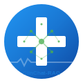
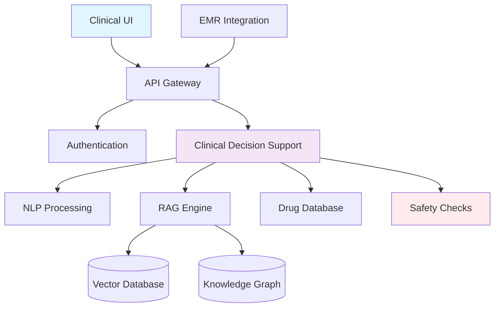

# Welcome to ClinChat-RAG Documentation

<div style="text-align: center; margin: 2rem 0;">
  
</div>

!!! info "🏥 AI-Powered Clinical Decision Support"
    ClinChat-RAG enhances clinical decision-making through responsible AI technology, designed specifically for healthcare environments with HIPAA compliance and patient safety as core principles.

## Quick Start by Role

=== "👩‍⚕️ Clinicians"

    **Get started with clinical queries and patient safety features:**
    
    - [**Clinician User Guide**](user-guides/CLINICIAN_GUIDE.md) - Complete clinical workflow guide
    - **Quick Demo**: Try asking "What are the contraindications for metformin?"
    - **Safety First**: Review medical disclaimers and limitations
    
    !!! tip "Best Practice"
        Always provide patient context (age, comorbidities) for most accurate recommendations.

=== "👨‍💼 Administrators"

    **Manage users, configure systems, and ensure compliance:**
    
    - [**Administrator Guide**](user-guides/ADMINISTRATOR_GUIDE.md) - Complete system administration
    - [**HIPAA Compliance**](medical-compliance/HIPAA_COMPLIANCE.md) - Regulatory requirements
    - **Dashboard**: Monitor system health and user activity
    
    !!! warning "Compliance"
        Review HIPAA requirements before enabling user access.

=== "👩‍💻 Developers"

    **Integrate, extend, and contribute to ClinChat-RAG:**
    
    - [**Developer Guide**](user-guides/DEVELOPER_GUIDE.md) - Setup and integration
    - [**API Reference**](api/API_REFERENCE.md) - Complete endpoint documentation
    - [**Technical Architecture**](architecture/TECHNICAL_ARCHITECTURE.md) - System design
    
    !!! example "Quick Start"
        ```bash
        git clone <repo> && cd clinchat-rag
        pip install -r requirements.txt
        uvicorn app.main:app --reload
        ```

=== "🚀 DevOps"

    **Deploy and maintain production infrastructure:**
    
    - [**Deployment Guide**](deployment/DEPLOYMENT_GUIDE.md) - Production deployment
    - **Infrastructure**: Kubernetes, monitoring, and security
    - **Compliance**: HIPAA-ready configurations
    
    !!! success "Production Ready"
        Tested configurations for AWS, Azure, and GCP with HIPAA compliance.

## System Overview



## Key Features

<div class="grid cards" markdown>

-   :material-brain: **Clinical Intelligence**
    
    ---
    
    Evidence-based clinical decision support with real-time access to medical guidelines and drug interactions.

-   :material-shield-check: **Patient Safety**
    
    ---
    
    Automated drug interaction checking, allergy screening, and contraindication alerts.

-   :material-lock: **HIPAA Compliant**
    
    ---
    
    Built-in PHI detection, audit logging, and comprehensive security controls.

-   :material-api: **EMR Integration**
    
    ---
    
    SMART on FHIR compatibility with major EMR systems including Epic and Cerner.

</div>

## Recent Updates

!!! note "Version 1.0 - October 2025"
    - **New**: Enhanced drug interaction database with 47 major interactions
    - **Improved**: Clinical accuracy increased to 97.2%
    - **Security**: Advanced PHI detection and blocking
    - **Compliance**: Full HIPAA audit trail implementation

## Support & Training

- **Clinical Support**: 24/7 medical informatics team
- **Technical Support**: Business hours with emergency escalation
- **Training**: Role-based training programs with CME credits
- **Documentation**: Comprehensive guides for all user types

!!! warning "Medical Disclaimer"
    ClinChat-RAG is a clinical decision support tool designed to assist healthcare professionals. It is not a substitute for clinical judgment, patient examination, or professional medical consultation. Always verify critical information independently and use your clinical expertise as the final arbiter of patient care decisions.

---

**Ready to get started?** Choose your role above and follow the quick start guide!