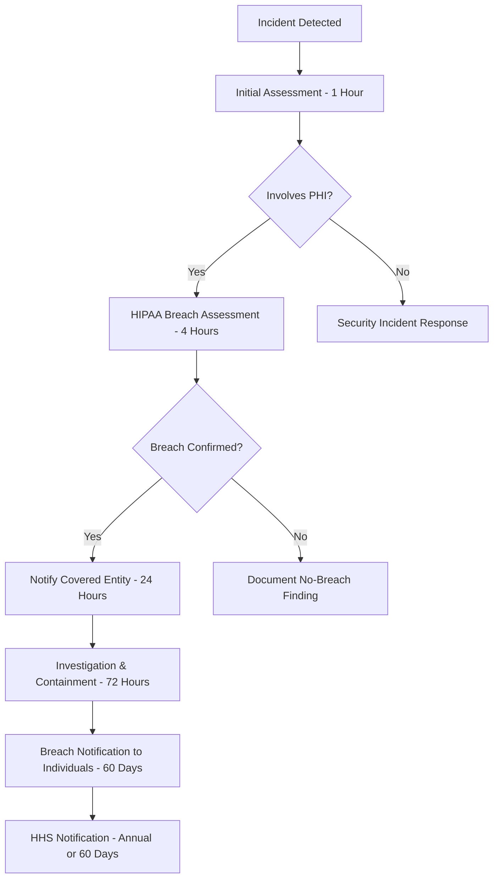

# 🏥 HIPAA Compliance Guide

## 📋 Overview

ClinChat-RAG is designed to be fully HIPAA-compliant for healthcare environments. This document outlines our compliance measures, implementation details, and operational procedures to ensure Protected Health Information (PHI) security.

## 🔒 HIPAA Safeguards Implementation

### Administrative Safeguards

#### Security Officer Designation
- **Assigned Security Officer**: Chief Information Security Officer (CISO)
- **Contact**: security-officer@clinchat-rag.com
- **Responsibilities**: 
  - Oversee HIPAA compliance implementation
  - Conduct regular security assessments
  - Manage incident response procedures
  - Coordinate with covered entities

#### Workforce Training
```markdown
## Required Training Components

1. **HIPAA Fundamentals** (Annual)
   - PHI identification and handling
   - Minimum necessary standard
   - Patient rights under HIPAA
   - Breach notification procedures

2. **Technical Training** (Quarterly)
   - Secure system access procedures
   - Data encryption protocols
   - Audit logging requirements
   - Incident reporting

3. **Role-Specific Training**
   - Clinical users: Medical ethics and privacy
   - Administrators: Access control management
   - Developers: Secure coding practices
```

#### Access Management
- **Role-Based Access Control (RBAC)**
  - Clinician: Clinical query and patient safety features
  - Administrator: User management and system configuration
  - Auditor: Read-only access to audit logs
  - Developer: Limited development environment access

- **Principle of Least Privilege**
  - Users granted minimum necessary access
  - Regular access reviews (quarterly)
  - Automatic access revocation for inactive users
  - Time-limited elevated privileges

### Physical Safeguards

#### Facility Access Controls
```yaml
Data Center Security:
  Location: "SOC 2 Type II Certified Facilities"
  Access Control: "Biometric + Smart Card Authentication"
  Monitoring: "24/7 Video Surveillance"
  Environmental: "Climate Control, Fire Suppression"
  
Workstation Security:
  Screen Locks: "Automatic after 10 minutes inactivity"
  Physical Security: "Cable locks, secure storage"
  Clean Desk Policy: "No PHI on unattended workstations"
  Device Encryption: "Full disk encryption required"
```

#### Workstation Use
- **Approved Devices Only**
  - Company-managed devices with security controls
  - Mobile Device Management (MDM) for tablets/phones
  - Prohibited use of personal devices for PHI access
  - Regular security patching and updates

#### Device and Media Controls
- **Data Storage Requirements**
  - All PHI encrypted at rest (AES-256)
  - No local storage of PHI on endpoints
  - Secure cloud storage with access controls
  - Regular backup and recovery testing

### Technical Safeguards

#### Access Control
```json
{
  "authentication": {
    "method": "multi_factor_authentication",
    "factors": ["password", "security_token", "biometric"],
    "session_timeout": "30_minutes_inactivity",
    "password_policy": {
      "min_length": 12,
      "complexity": "uppercase_lowercase_numbers_symbols",
      "rotation": "90_days",
      "history": "last_12_passwords"
    }
  },
  "authorization": {
    "model": "role_based_access_control",
    "granularity": "resource_level",
    "audit_trail": "all_access_logged"
  }
}
```

#### Audit Controls
```sql
-- Example Audit Log Schema
CREATE TABLE hipaa_audit_log (
    id BIGINT PRIMARY KEY,
    timestamp TIMESTAMP WITH TIME ZONE NOT NULL,
    user_id VARCHAR(255) NOT NULL,
    user_role VARCHAR(100) NOT NULL,
    action VARCHAR(100) NOT NULL,
    resource_type VARCHAR(100),
    resource_id VARCHAR(255),
    patient_id_hash VARCHAR(64), -- Hashed for privacy
    ip_address INET,
    user_agent TEXT,
    session_id VARCHAR(255),
    success BOOLEAN NOT NULL,
    failure_reason TEXT,
    phi_accessed BOOLEAN DEFAULT FALSE,
    medical_specialty VARCHAR(100),
    facility_id VARCHAR(255)
);

-- Audit Events Tracked
-- - User authentication (success/failure)
-- - PHI access and viewing
-- - Data modifications
-- - Export/download activities
-- - Administrative actions
-- - System configuration changes
```

#### Integrity
- **Data Integrity Measures**
  - Cryptographic checksums for all data
  - Version control for medical documents
  - Immutable audit logs
  - Digital signatures for critical transactions

#### Transmission Security
```yaml
Encryption in Transit:
  Protocol: "TLS 1.3"
  Cipher Suites: "AEAD ciphers only"
  Certificate Management: "Automated rotation"
  
API Security:
  Authentication: "OAuth 2.0 + JWT"
  Rate Limiting: "Per user/role"
  Input Validation: "Strict schema enforcement"
  
Internal Communication:
  Service Mesh: "mTLS between microservices"
  Message Queues: "Encrypted message transport"
  Database: "Encrypted connections only"
```

## 🔍 PHI Handling Procedures

### PHI Identification
```python
# Automated PHI Detection Patterns
PHI_PATTERNS = {
    "names": r"\b[A-Z][a-z]+ [A-Z][a-z]+\b",
    "ssn": r"\b\d{3}-\d{2}-\d{4}\b",
    "phone": r"\b\d{3}-\d{3}-\d{4}\b",
    "email": r"\b[A-Za-z0-9._%+-]+@[A-Za-z0-9.-]+\.[A-Z|a-z]{2,}\b",
    "medical_record_number": r"\b(MRN|mrn)[:=\s]*\d+\b",
    "dates": r"\b\d{1,2}[/-]\d{1,2}[/-]\d{2,4}\b",
    "addresses": r"\b\d+\s+[A-Za-z\s]+(Street|St|Avenue|Ave|Road|Rd|Boulevard|Blvd)\b"
}

def detect_phi(text):
    """
    Detect potential PHI in text input
    Returns: List of detected PHI with locations and types
    """
    detected_phi = []
    for phi_type, pattern in PHI_PATTERNS.items():
        matches = re.finditer(pattern, text, re.IGNORECASE)
        for match in matches:
            detected_phi.append({
                "type": phi_type,
                "value": match.group(),
                "start": match.start(),
                "end": match.end(),
                "risk_level": get_phi_risk_level(phi_type)
            })
    return detected_phi
```

### Minimum Necessary Standard
- **Query Processing**
  - Only clinically relevant information returned
  - User role determines data granularity
  - Automatic redaction of unnecessary identifiers
  - Purpose-based access controls

### De-identification Procedures
```python
# Safe Harbor De-identification
SAFE_HARBOR_IDENTIFIERS = [
    "names", "geographic_subdivisions", "dates", 
    "phone_numbers", "fax_numbers", "email_addresses",
    "ssn", "medical_record_numbers", "health_plan_numbers",
    "account_numbers", "certificate_numbers", "vehicle_identifiers",
    "device_identifiers", "web_urls", "ip_addresses",
    "biometric_identifiers", "face_photos", "other_unique_ids"
]

def deidentify_text(text, method="safe_harbor"):
    """
    Remove or replace PHI according to Safe Harbor method
    """
    if method == "safe_harbor":
        for identifier_type in SAFE_HARBOR_IDENTIFIERS:
            text = remove_identifier(text, identifier_type)
    
    return {
        "deidentified_text": text,
        "method": method,
        "timestamp": datetime.utcnow(),
        "phi_removed_count": count_removed_identifiers(text)
    }
```

## 🚨 Breach Response Procedures

### Incident Detection
```yaml
Automated Monitoring:
  - Unusual access patterns
  - Failed authentication attempts
  - Large data exports
  - After-hours system access
  - Geographic anomalies

Alert Thresholds:
  - 5+ failed logins: Immediate alert
  - PHI access outside normal hours: Review required  
  - Bulk data download: Approval required
  - New device access: Multi-factor verification
```

### Breach Assessment Timeline


### Notification Requirements
- **Covered Entity**: Within 24 hours of breach discovery
- **Individuals Affected**: Within 60 days of breach discovery
- **HHS**: Within 60 days (>500 individuals) or annually (<500)
- **Media**: Within 60 days if >500 individuals in same state/jurisdiction

## 📋 Risk Assessment

### Annual Risk Assessment Framework
```markdown
## Assessment Components

1. **Administrative Safeguards Review**
   - Policy effectiveness
   - Training completion rates
   - Access control reviews
   - Incident response testing

2. **Physical Safeguards Evaluation**
   - Facility security assessment
   - Workstation vulnerability testing
   - Media handling procedures
   - Environmental controls

3. **Technical Safeguards Testing**
   - Penetration testing
   - Vulnerability assessments
   - Encryption validation
   - Audit log analysis

4. **Business Associate Assessment**
   - BAA compliance review
   - Subcontractor evaluations
   - Security control validation
   - Incident notification testing
```

### Risk Mitigation Strategies
| Risk Category | Likelihood | Impact | Mitigation |
|---------------|------------|--------|------------|
| Unauthorized PHI Access | Low | High | MFA, RBAC, Audit Monitoring |
| Data Breach via Insider | Medium | High | Background checks, Access reviews |
| External Cyber Attack | Medium | High | Security monitoring, Incident response |
| System Vulnerabilities | Medium | Medium | Regular patching, Security testing |
| Third-party Risk | Low | High | BAA management, Vendor assessments |

## 🤝 Business Associate Agreements (BAAs)

### Required BAA Components
```markdown
## Standard BAA Terms

1. **Permitted Uses and Disclosures**
   - Clinical decision support only
   - De-identification services
   - System administration
   - Legal compliance activities

2. **Prohibited Uses**
   - Marketing purposes
   - Re-identification attempts
   - Unauthorized disclosures
   - Non-healthcare uses

3. **Safeguards Requirements**
   - Administrative safeguards
   - Physical safeguards
   - Technical safeguards
   - Breach notification procedures

4. **Subcontractor Management**
   - Written agreements required
   - Same safeguards application
   - Incident notification chain
   - Liability provisions
```

### Current Business Associates
| Entity | Services | BAA Status | Last Review |
|--------|----------|------------|-------------|
| AWS | Cloud Infrastructure | ✅ Active | 2024-09-15 |
| MongoDB Atlas | Database Services | ✅ Active | 2024-08-20 |
| Datadog | Monitoring/Logging | ✅ Active | 2024-07-10 |
| Auth0 | Authentication Services | ✅ Active | 2024-09-01 |

## 📊 Compliance Monitoring

### Key Performance Indicators (KPIs)
```yaml
Security Metrics:
  - Authentication success rate: >99.9%
  - Unauthorized access attempts: <0.1%
  - Patch compliance: >98%
  - Audit log completeness: 100%

Privacy Metrics:
  - PHI auto-detection accuracy: >99%
  - False positive rate: <2%
  - De-identification success: >99.9%
  - User training completion: 100%

Operational Metrics:
  - Incident response time: <1 hour
  - Breach assessment time: <4 hours
  - System availability: >99.9%
  - Data backup success: 100%
```

### Compliance Reporting
- **Monthly**: Security metrics dashboard
- **Quarterly**: Risk assessment updates  
- **Annually**: Comprehensive compliance audit
- **Ad-hoc**: Incident reports and breach notifications

## 📞 Compliance Contacts

### Internal Contacts
- **HIPAA Security Officer**: hipaa-security@clinchat-rag.com
- **Privacy Officer**: privacy-officer@clinchat-rag.com
- **Compliance Team**: compliance@clinchat-rag.com
- **Legal Counsel**: legal@clinchat-rag.com

### External Resources
- **HHS Office for Civil Rights**: https://www.hhs.gov/ocr/
- **HIPAA Helpline**: 1-800-368-1019
- **Breach Reporting**: https://ocrportal.hhs.gov/ocr/breach/

---

**⚠️ Important Note**: This document provides general HIPAA compliance guidance. Healthcare organizations should consult with legal counsel and compliance experts to ensure their specific implementation meets all applicable requirements.

**Document Version**: 1.0  
**Last Updated**: October 20, 2024  
**Next Review**: January 20, 2025